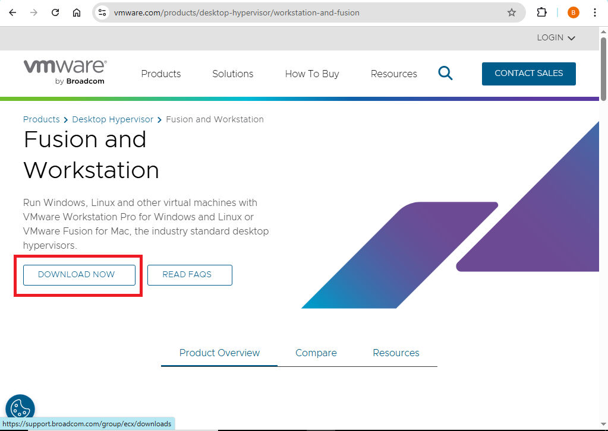
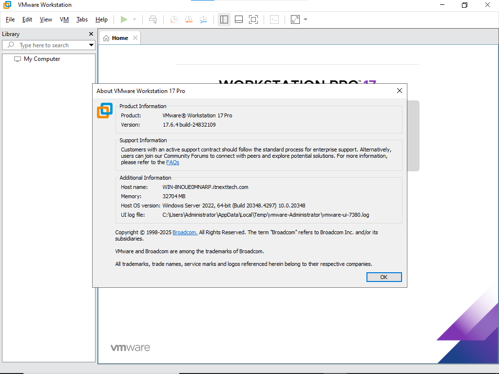

# VMware Workstation Pro Installation Guide

## Overview
This document describes the steps to download, install, and verify VMware Workstation Pro on a Windows host. It is the first step in setting up a VMware lab for Windows Server 2022, Windows 11 clients, and Rocky Linux 9.

---

## 1. Download VMware Workstation Pro

1. Open your web browser and go to: [VMware Workstation Pro Download](https://www.vmware.com/products/workstation-pro/workstation-pro-evaluation.html)  
2. Select **Windows** as your operating system.  
3. Click **Download** and save the installer to a known location.  

> **Screenshot:**  
> 

---

## 2. Install VMware Workstation Pro

1. Run the downloaded `.exe` file.  
2. Click **Next** on the welcome screen.  
3. Accept the **license agreement** and click **Next**.  
4. Choose the installation path (default is recommended) → Click **Next**.  
5. Enable or disable **Enhanced Keyboard Driver** (optional) → Click **Next**.  
6. Choose whether to **Check for product updates on startup** → Click **Next**.  
7. Click **Install** to start the installation.  
8. Wait for installation to complete → Click **Finish**.  

> **Screenshot:** `screenshots/install_vmware.png`

---

## 3. Verify Installation

1. Open **VMware Workstation Pro** from the Start Menu.  
2. Navigate to **Help → About VMware Workstation** to confirm the installed version.  
3. Take a screenshot of the VMware Workstation main window for documentation.  

> **Screenshot:**  
> 

---

## 4. Notes

- Make sure **Hyper-V (Windows Hypervisor) is disabled** before installing VMware Workstation, otherwise it may fail to run VMs.  
- Ensure your system meets the minimum requirements for VMware Workstation Pro.  
- Save all screenshots in the `screenshots` folder for consistency.  
- Keep the installer in a safe location in case you need to reinstall.

